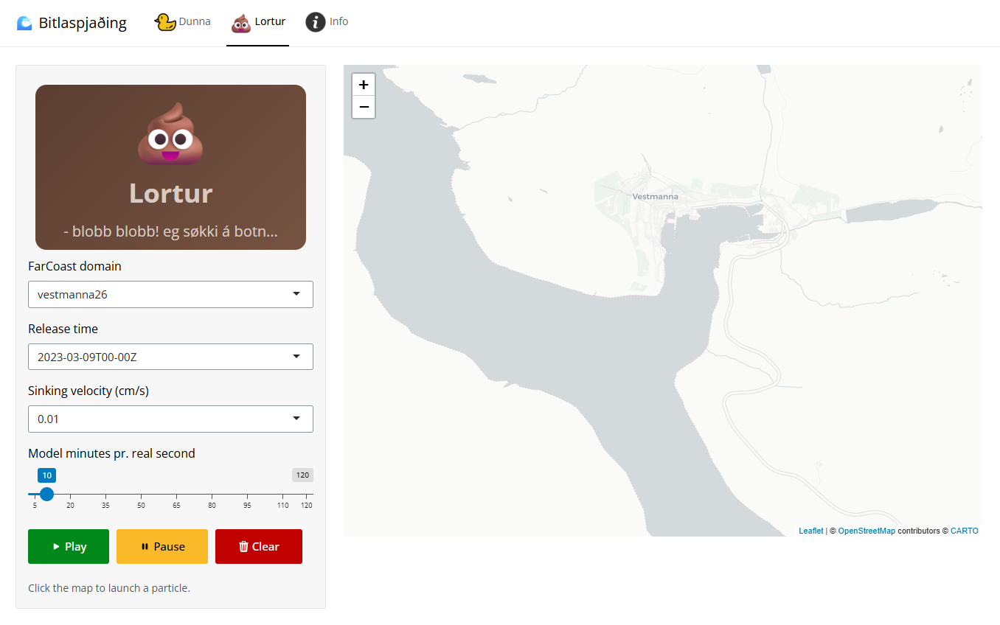

# visindavoka2025_particles

Shiny app to demo particle tracking at [Vísindavøka 2025](https://visindavoka.fo/) (Faroese Researchers Night).  
Showcasing the 3D ocean model [FarCoast](https://firum.fo/farcoast) and particle tracking using the Lagrangian Advection and Diffusion Model ([LADiM](https://github.com/pnsaevik/ladim)) utilising different ibm plugins for LADiM [ladim_plugins](https://github.com/pnsaevik/ladim_plugins)

There is a version running here: [visindavoka2025_particles](https://shiny.firum.fo/visindavoka2025_particles/)  
*p.s. I'm not sure how long that site will stay live, so please don't come at me 😉*

